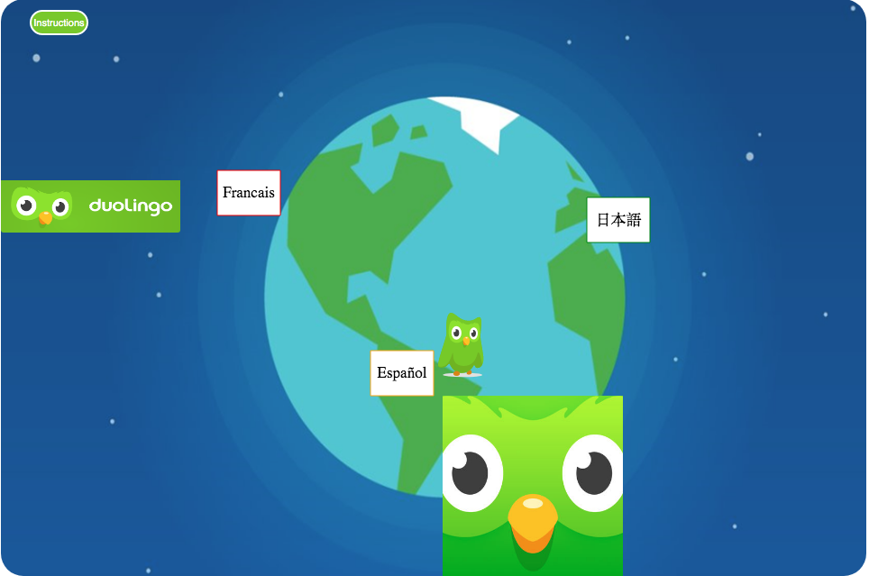
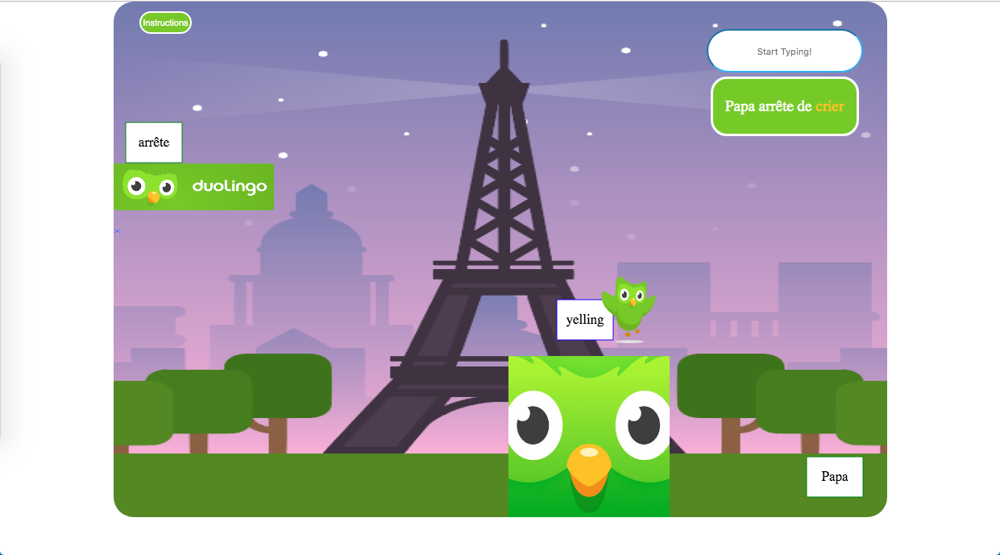
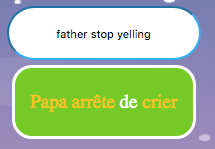
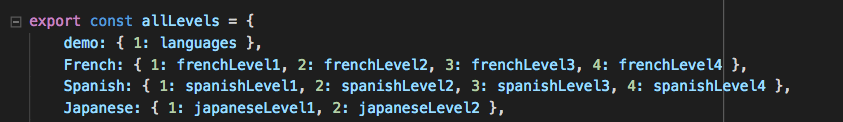
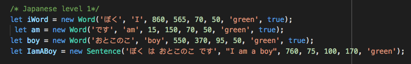
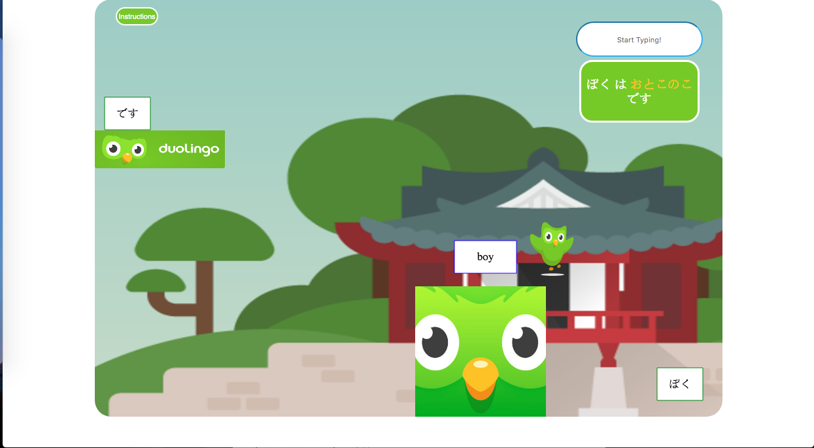
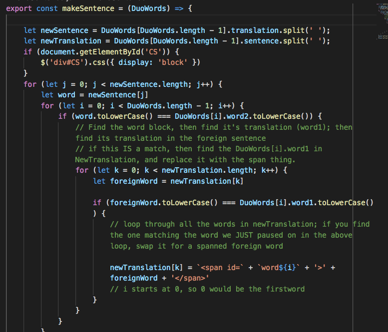
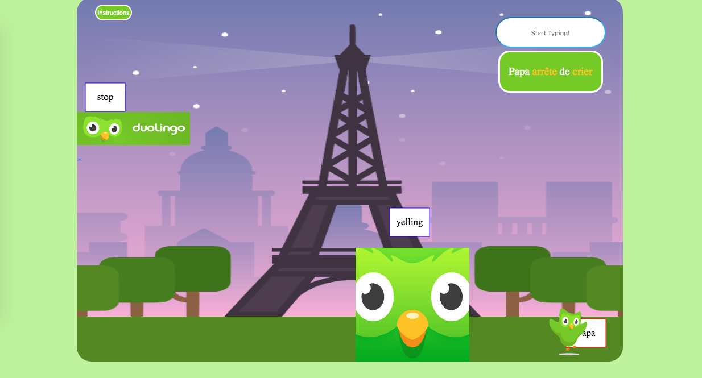
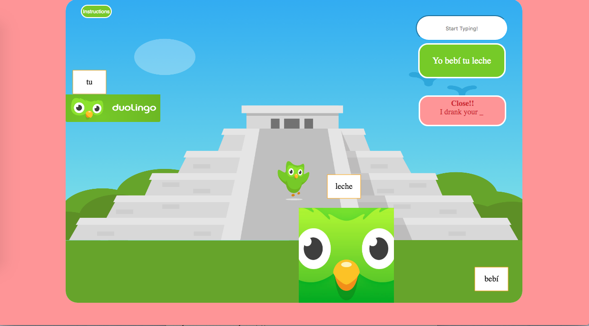
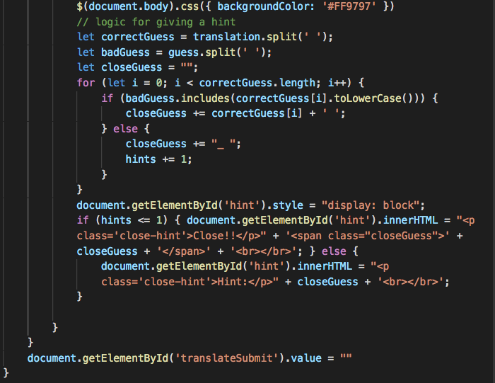

# JuoDuo

JuoDuo is a translation platformmer, inspired by (and boldly infringing upon) Duolingo. Move the owl around the board! Toggle words! Translate sentences! 

# Key Features 

## Choose a Language 

Users choose one of three languages by 'flying' over to the language and clicking 'Shift'. 

Once a level has been chosen, Duo will travel to that country. There, there will be a sentence for Duo to translate in the top right, plus several associated word 'hint boxes'.

## Toggle Words 

Duo 'toggles' words by colliding with them and pressing 'Shift'. Words will flip between their English translation and their foreign translation. Notice that in the top right, the word in the Sentence string will turn yellow when the word has been 'toggled'.

Here's how it works: 

allLevels is an object containing keys for each language:

Since the default starts at 'Demo', we initially key into demo on the homepage:

Once when we choose a language, we key into the allLevels object at the respective key. Then, we key into the level. Each level points to a variable containing an array of up to three word objects and sentence object - each of which is a Canvas object:

becomes....

To get the toggle feature, we go through each letter in the sentence, and loop through each of the three word objects. If there's a match, we replace the word in the sentence with a 'span' wrapped version, so that we can target it with CSS each time we interact with a word.
 

## Submitting a Guess 

The point of 'JuoDuo' is to translate sentences! When you correctly submit a guess, the background lights up green:

When you guess incorrectly, the background flashes raspberry red and provides you a hint message based on how close you were, plus a reconstruction of the sentence with the missing words replaced with underscores:

(the guess was: "I drink your milkshake")

We handle this in the HandleSubmit function. 

## HandleSubmit 

After flashing the background red, we create an empty string variable, closeGuess. We're going to start builidng out a reconstructed sentence, with underscores in place of words we guessed incorrectly. Of course, we don't care about capitilization too much, so we convert each word to its lowerCase version before comparing.

Next, we split up the user submitted guess and check each word against the actual sentence. If it's Correct, we += its string value to the closeGuess variable. If it's InCorrect, we += an 'underscore' to show that the word at that position in the sentence was incorrect. We also keep track each time we add an 'undescore' with a counter, to know *how* close a guess it was.

## Learn! Learn! Learn!

Language support for French, Spanish and Japanese! 

UPCOMING BONUS PLANS: 

This June I made a comprehensive fullstack clone of Duolingo, which I reverse-engineered using the publically available Duolingo User & LanguageData JSON. In July, I'll be incorporating JuoDuo into 'DuoJuo' (Duolingo) as a feature!

Do you work for Duolingo? Hire this guy!

